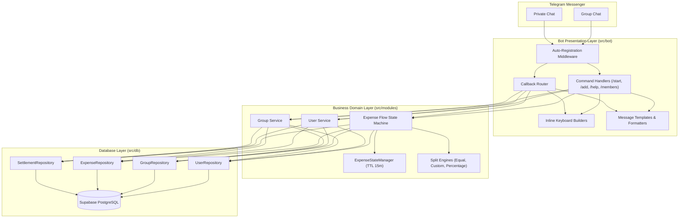
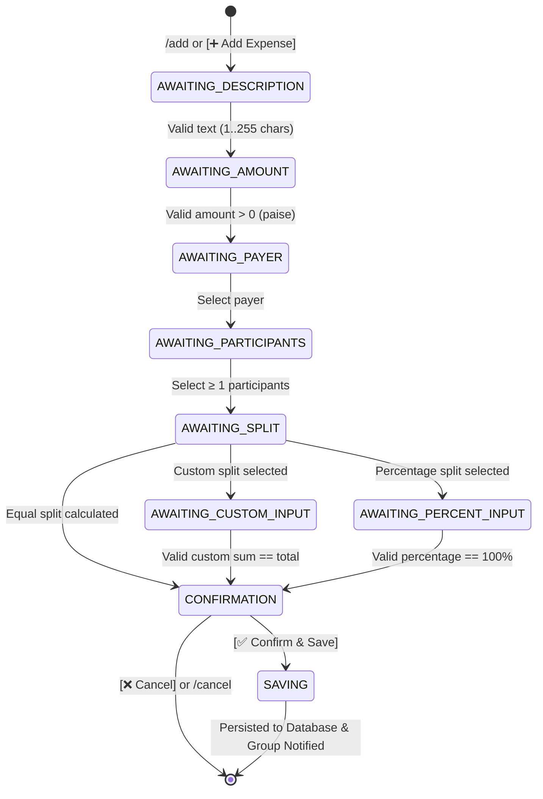

<div align="center">

# 💸 BuddySplitter

**Group expenses made simple. Split expenses directly inside Telegram without spreadsheets or external apps.**

[](https://www.typescriptlang.org/)
[](https://nodejs.org/)
[](https://grammy.dev/)
[](https://supabase.com/)
[](https://vitest.dev/)
[](LICENSE)

<p align="center">
  <a href="#-key-features">Key Features</a> •
  <a href="#-interactive-conversational-flow">Conversational Flow</a> •
  <a href="#-system-architecture">Architecture</a> •
  <a href="#-quickstart">Quickstart</a> •
  <a href="#-bot-commands">Bot Commands</a> •
  <a href="#-roadmap">Roadmap</a>
</p>

</div>

---

## 📖 Overview

**BuddySplitter** is a Telegram-native expense splitting bot built with **TypeScript (strict mode)**, **grammY**, and **Supabase PostgreSQL**. 

Unlike traditional split tools (Splitwise, spreadsheets, web apps), BuddySplitter lives directly inside your Telegram group chats:
- **Zero Friction:** No new apps to download, no accounts to register. The chat group you already use with your roommates, travel buddies, or friends is the interface.
- **Financial Precision:** Every monetary transaction is strictly stored and calculated in integer minor units (**paise**: `₹1 = 100 paise`), eliminating IEEE-754 floating-point rounding errors.
- **Fair Split Algorithms:** Built-in split strategies including the **Hare-Niemeyer / Largest Remainder Method** for percentage allocations and deterministic remainder redistribution.

---

## ✨ Key Features

| Feature | Description |
| :--- | :--- |
| ⚡ **Telegram-Native UX** | Interactive inline keyboards, menus, and real-time group notifications. |
| 🤖 **Interactive Multi-Step Wizard** | Conversational flow for logging expenses: Description ➔ Amount ➔ Payer ➔ Participants ➔ Split Mode ➔ Confirmation. |
| ⚖️ **4 Split Engines** | **Equal Split** (remainder distribution), **Custom Amounts** (real-time validation), **Percentage** (Hare-Niemeyer method), and **Shares** (deterministic largest remainder). |
| 📊 **Mathematical Balance Engine** | Exact per-member net balance calculation (`paid - owed`) audited by conservation invariant `SUM(netBalance) === 0` and zero float drift. |
| 💸 **Greedy Settlement Engine** | Debt simplification via greedy bipartite matching, producing minimal recommended transfers (bounded by at most $N-1$ transactions). |
| 💳 **Repayment Tracking** | Full and partial repayments recorded without mutating original expenses; automatic dynamic balance reconciliation with overpayment guards. |
| 📋 **Expense Management** | History pagination (`/expenses`), details viewer, single-field description editing, full financial editing, soft-deletion, and repayment safety locks. |
| 💎 **Zero Float Drift** | All currency operations are calculated in integer minor units (paise). ₹1500.50 is handled as `150050` paise. |
| 🔒 **State Isolation & Concurrency** | In-memory session state scoped by composite key `${chatId}:${userId}` with a 15-minute TTL eviction, allowing multiple members to log expenses simultaneously. |
| 🛡️ **Atomicity & Idempotency** | Double-tap prevention using transient `SAVING` state lock; automatic compensating rollback deletion if split persistence fails. |
| 👥 **Transparent Onboarding** | Automatic user and group registration on every interaction with 64-bit Telegram ID safety. |

---

## 💬 Interactive Conversational Flow

Here is what the expense creation experience looks like inside Telegram:

```text
User:   /add
Bot:    📝 What is this expense for?
        Send the description (e.g. Dinner, Groceries, Flight tickets):

User:   Dinner at Bistro
Bot:    💰 How much was spent?
        Enter amount in ₹ (e.g. 1500 or 1500.50):

User:   1500
Bot:    👤 Who paid for "Dinner at Bistro" (₹1,500.00)?
        [🙋 I Paid (Alice)]  [👥 Select Someone Else]

User:   [Taps "🙋 I Paid"]
Bot:    👥 Who was involved in this expense?
        [✅ Alice (You)]  [✅ Bob]
        [✅ Charlie]      [✅ David]
        [🔄 Select All]   [➡️ Done (4 selected)]

User:   [Taps "➡️ Done"]
Bot:    ⚖️ How would you like to split ₹1,500.00 among 4 members?
        [⚖️ Split Equally]
        [✏️ Custom Exact Amounts]
        [📊 Split by Percentage (%)]

User:   [Taps "⚖️ Split Equally"]
Bot:    📋 Confirm Expense Details:
        ━━━━━━━━━━━━━━━━━━━━━━━━━━━━
        📝 Description:  Dinner at Bistro
        💰 Total Amount: ₹1,500.00
        👤 Paid By:      Alice
        ⚖️ Split Type:    Equal (4 participants)

        Split Breakdown:
        • Alice:   ₹375.00
        • Bob:     ₹375.00
        • Charlie: ₹375.00
        • David:   ₹375.00
        ━━━━━━━━━━━━━━━━━━━━━━━━━━━━
        [✅ Confirm & Save]  [❌ Cancel]

User:   [Taps "✅ Confirm & Save"]
Bot:    🎉 Expense Saved!
        "Dinner at Bistro" (₹1,500.00) recorded by Alice.
```

---

## 🏗 System Architecture

BuddySplitter enforces a strict 3-tier architecture ensuring separation of concerns, testability, and reliability:



### Conversational State Machine



---

## 🗄 Database Schema

The database is built on PostgreSQL via Supabase, with full relational integrity and constraints:

- `users`: Registered Telegram users (`telegram_user_id` BigInt, `username`, `first_name`, `last_name`).
- `groups`: Tracked Telegram groups (`telegram_group_id` BigInt, `title`, `default_currency`).
- `group_members`: Membership mapping (`user_id`, `group_id`, `joined_at`, `is_active`).
- `expenses`: Logged expenses (`group_id`, `paid_by_user_id`, `description`, `total_amount`, `split_type`, `created_by_user_id`).
- `expense_splits`: Individual allocations (`expense_id`, `user_id`, `amount_owed`, `percentage`, `shares`).
- `settlements`: Recorded payments between members (`group_id`, `from_user_id`, `to_user_id`, `amount`, `status`).

---

## 🤖 Bot Commands

| Command | Chat Type | Description |
| :--- | :--- | :--- |
| `/start` | Private / Group | Initializes bot, auto-registers user/group, renders interactive menu |
| `/help` | Private / Group | Comprehensive command manual and instructions |
| `/add` | Group Only | Starts the multi-step expense creation wizard |
| `/members` | Group Only | Displays active registered members in the current group |
| `/balance` | Group Only | View your personal balance (paid, share, net standing) in the group |
| `/summary` | Group Only | View full group summary with creditors, debtors, and totals |
| `/settle` | Group Only | View recommended debt-simplified settlement plan |
| `/payments` | Group Only | View recent payment and repayment history |
| `/expenses` | Group Only | View, edit, or delete recent group expenses |
| `/cancel` | Group Only | Aborts the current active conversational wizard session |

---

## 🛠 Tech Stack

| Technology | Purpose |
| :--- | :--- |
| **[Node.js](https://nodejs.org/)** (v20+) | High-performance asynchronous JavaScript runtime |
| **[TypeScript](https://www.typescriptlang.org/)** (v5.9+) | Static typing with strict mode enabled |
| **[grammY](https://grammy.dev/)** | Fast, robust, and extensible Telegram Bot framework |
| **[Supabase](https://supabase.com/)** | Managed PostgreSQL database with instant REST/realtime APIs |
| **[Zod](https://zod.dev/)** | Runtime schema validation for environment variables & callback data |
| **[Vitest](https://vitest.dev/)** | Blazing-fast unit testing runner |

---

## ⚡ Quickstart

### Prerequisites

- [Node.js](https://nodejs.org/) v20 or higher
- A Telegram Bot Token from [@BotFather](https://t.me/BotFather)
- A [Supabase](https://supabase.com/) project (PostgreSQL)

### 1. Clone & Install

```bash
git clone https://github.com/divyanshubochiwal04/BuddySplitter.git
cd BuddySplitter
npm install
```

### 2. Environment Configuration

Copy `.env.example` to `.env` and fill in your credentials:

```bash
cp .env.example .env
```

```env
TELEGRAM_BOT_TOKEN="123456789:ABCdefGHIjklMNOpqrSTUvwxYZ"
SUPABASE_URL="https://your-project.supabase.co"
SUPABASE_ANON_KEY="your-anon-key"
SUPABASE_SERVICE_ROLE_KEY="your-service-role-key"
NODE_ENV="development"
PORT="3000"
TELEGRAM_WEBHOOK_SECRET="your-secure-webhook-secret"
TELEGRAM_WEBHOOK_PATH="/telegram/webhook"
```

### 3. Database Migration

Run the SQL migration in your Supabase SQL Editor:
- File: [`supabase/migrations/20260919000000_create_buddysplitter_schema.sql`](supabase/migrations/20260919000000_create_buddysplitter_schema.sql)

### 4. Run Locally in Webhook Mode

BuddySplitter runs a production-grade webhook server using Node.js's native `http` module listening on `0.0.0.0:${PORT}`.

```bash
# Typecheck
npm run typecheck

# Run unit tests
npm test

# Build production bundle
npm run build

# Start bot in webhook mode
npm start
```

#### Endpoints:
- `GET /health` -> Returns `{"status":"ok"}` (used by health checks / Render).
- `POST /telegram/webhook` -> Dedicated endpoint for incoming Telegram updates authenticated via `X-Telegram-Bot-Api-Secret-Token`.

#### Testing Webhooks Locally:

To test incoming Telegram updates on your local machine:
1. Start a local tunnel (e.g. using `ngrok` or `cloudflared`):
   ```bash
   ngrok http 3000
   ```
2. Register your public tunnel URL with Telegram's Bot API:
   ```bash
   curl -X POST "https://api.telegram.org/bot<YOUR_TELEGRAM_BOT_TOKEN>/setWebhook" \
     -H "Content-Type: application/json" \
     -d '{
       "url": "https://<your-ngrok-subdomain>.ngrok-free.app/telegram/webhook",
       "secret_token": "<YOUR_TELEGRAM_WEBHOOK_SECRET>"
     }'
   ```
3. Verify webhook status anytime:
   ```bash
   curl "https://api.telegram.org/bot<YOUR_TELEGRAM_BOT_TOKEN>/getWebhookInfo"
   ```

---

## 🧪 Testing & Code Quality

BuddySplitter maintains a high standard of code health with a comprehensive test suite:

```bash
npm test
```

```text
 ✓ src/bot/commands/settle-commands.test.ts (5 tests)
 ✓ src/modules/settlements/settlement.calculator.test.ts (16 tests)
 ✓ src/modules/settlements/settlement.formatter.test.ts (6 tests)
 ✓ src/modules/settlements/settlement.service.test.ts (6 tests)
 ✓ src/bot/commands/balance-commands.test.ts (8 tests)
 ✓ src/modules/balances/balance.calculator.test.ts (11 tests)
 ✓ src/modules/balances/balance.formatter.test.ts (6 tests)
 ✓ src/modules/balances/balance.service.test.ts (7 tests)
 ✓ src/modules/expenses/split/shares.test.ts (13 tests)
 ✓ src/modules/expenses/split/equal.test.ts (5 tests)
 ✓ src/modules/expenses/split/custom.test.ts (5 tests)
 ✓ src/modules/expenses/split/percentage.test.ts (4 tests)
 ✓ src/modules/expenses/expense-state.test.ts (4 tests)
 ✓ src/modules/expenses/expense-validation.test.ts (8 tests)
 ✓ src/modules/expenses/expense.service.test.ts (5 tests)
 ✓ src/modules/expenses/expense-flow.test.ts (20 tests)
 ✓ src/db/repositories/expenses.repository.test.ts (4 tests)
 ✓ src/db/repositories/settlements.repository.test.ts (5 tests)
 ✓ src/db/repositories/users.repository.test.ts (3 tests)
 ✓ src/db/repositories/groups.repository.test.ts (3 tests)
 ✓ src/db/repositories/group-members.repository.test.ts (3 tests)
 ✓ src/db/client.test.ts (1 test)
 ✓ src/modules/users/user.service.test.ts (2 tests)
 ✓ src/modules/groups/group.service.test.ts (2 tests)
 ✓ src/bot/middleware/registration.middleware.test.ts (3 tests)
 ✓ src/bot/callbacks/router.test.ts (4 tests)
 ✓ src/bot/callbacks/expense-callbacks.test.ts (9 tests)
 ✓ src/bot/commands/commands.test.ts (8 tests)
 ✓ src/bot/keyboards/keyboards.test.ts (7 tests)
 ✓ src/config/env.test.ts (6 tests)
 ✓ src/shared/currency.test.ts (6 tests)
 ✓ src/shared/errors.test.ts (3 tests)
 ✓ src/bot/bot.test.ts (1 test)

  Test Files  42 passed (42)
       Tests  268 passed (268)
```

---

## 🗺 Roadmap

- [x] **Phase 1: Foundation** — Node.js + strict TypeScript, Zod environment validation, graceful shutdown.
- [x] **Phase 2: Database Layer** — Supabase PostgreSQL schema with 6 tables, integer minor-unit paise, repository patterns.
- [x] **Phase 3: Telegram Core** — User/group auto-registration, interactive `/start`, `/help`, `/members`, callback router.
- [x] **Phase 4: Expense Flow** — Conversational wizard, 3 split engines (Equal, Custom, Hare-Niemeyer Percentage), idempotent lock, compensating rollback.
- [x] **Phase 5: Advanced Splits** — Share-based split (`shares` split type) with dynamic stepper UI, deterministic largest remainder rounding, participant modification, and split method switching.
- [x] **Phase 6: Balance Engine** — Mathematical net balance calculator, `/balance`, `/summary`, conservation invariant verification, deterministic sorting.
- [x] **Phase 7: Settlement Engine** — Debt simplification algorithm (greedy bipartite matching bounded by at most $N-1$ transactions), `/settle`, interactive settlement preview.
- [x] **Phase 8: Repayment & Settlement Tracking** — Trackable, immutable repayments without mutating expenses, dynamic balance reconciliation model, interactive payment recording wizard, overpayment guard, `/payments` history.
- [x] **Phase 9: Expense Management** — Expense history (`/expenses`), details viewer, single-field description editing, full financial editing, soft-deletion (`deleted_at`), domain authorization, and repayment safety locks.
- [ ] **Phase 10: UX Polish** — Multi-currency formatting, inline reminder notifications.
- [ ] **Phase 11: Security & Rate Limiting** — Antispam throttling, input sanitization, integration testing.
- [ ] **Phase 12: Production Deployment** — Docker containerization, Telegram webhook runner.

---

## 📄 License

This project is licensed under the MIT License - see the [LICENSE](LICENSE) file for details.

---

<div align="center">
  <sub>Built with ❤️ for hassle-free group expenses directly in Telegram.</sub>
</div>
